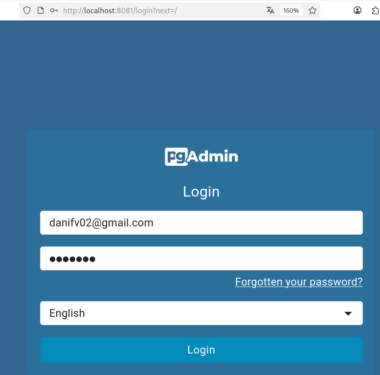
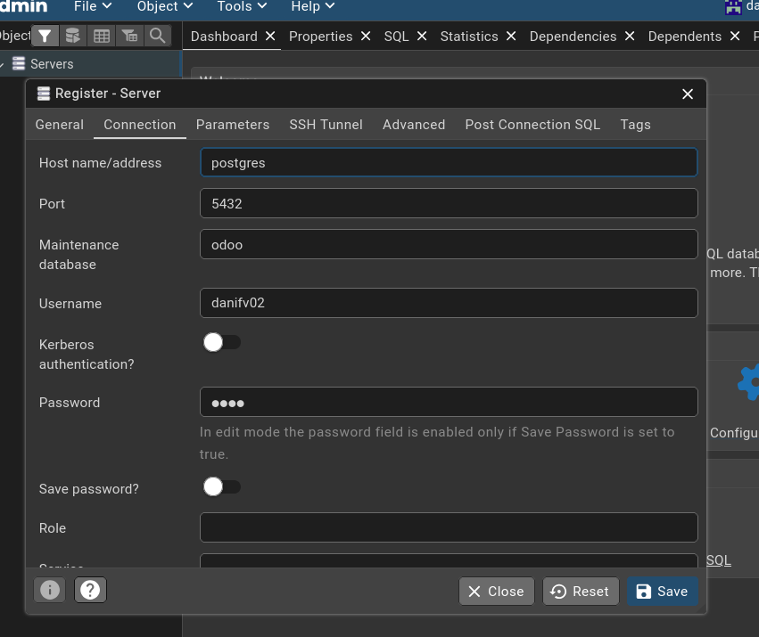
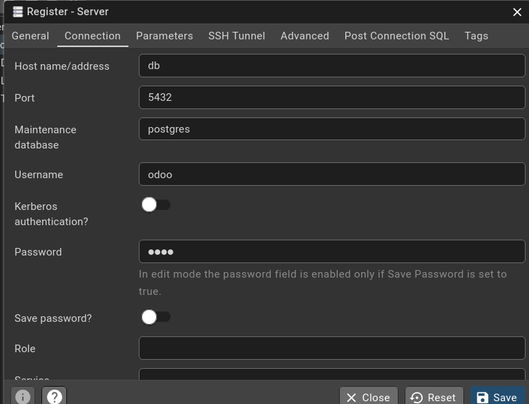
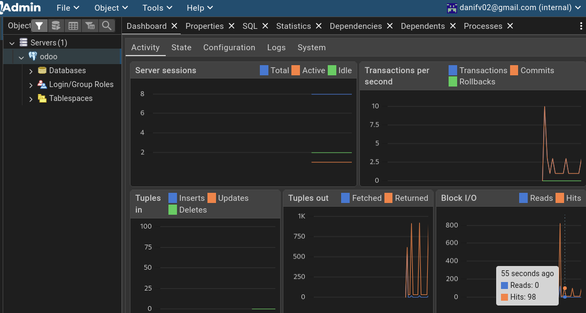
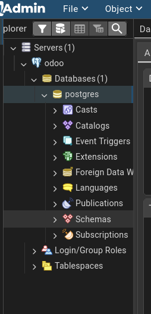

# Instalación de Odoo en DOCKER-COMPOSE

Esta guia describe los pasos para instalar Odoo utilizando Docker Compose.

Archivo docker-compose.yml de ejemplo:

```yaml
services:

  odoo:
    image: odoo:18 #
    container_name: odoo
    ports:
      - "8069:8069" # Usamos el puerto recomendado por Odoo
    depends_on: # Aseguramos que Odoo se inicie después de la base de datos
      - db
    environment:
      - HOST=db
      - USER:odoo
      - PASSWORD=odoo
    volumes:
      - odoo_data:/var/lib/odoo

  db:
    image: postgres:16 # Usaramos la version 16 de Postgres
    container_name: odoo_db
    environment:
      - POSTGRES_USER=odoo
      - POSTGRES_PASSWORD=odoo
      - POSTGRES_DB=postgres
    volumes:
      - db_data:/var/lib/postgresql/data

  pgadmin:
    image: dpage/pgadmin4:latest # Imagen oficial de pgAdmin
    restart: unless-stopped
    depends_on:
      - db # Aseguramos que pgAdmin se inicie después de la base de datos
    environment:
      - PGADMIN_DEFAULT_EMAIL=danifv02@gmail.com
      - PGADMIN_DEFAULT_PASSWORD=Abc123.
    ports:
      - "8081:80" # Mapeamos el puerto 80 del contenedor al 8081 del host

volumes:
  odoo_data: # Volumen para persistir datos de Odoo
  db_data: # Volumen para persistir datos de PostgreSQL
```









