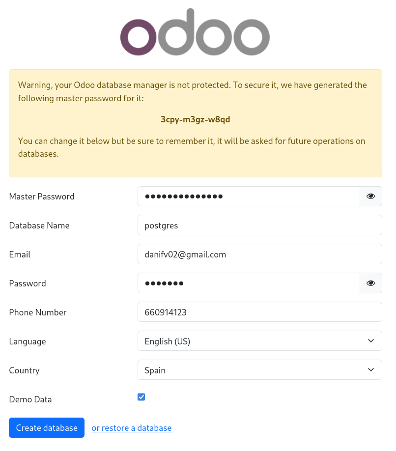
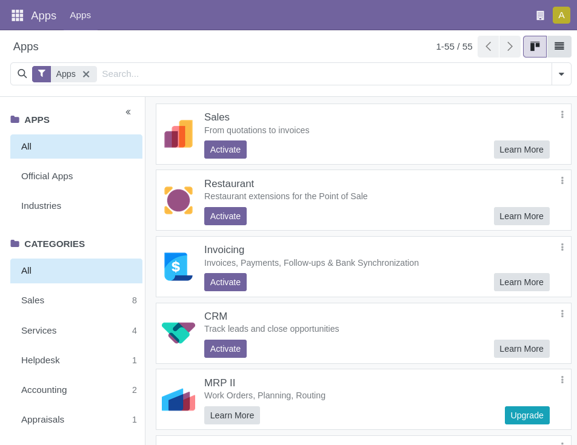
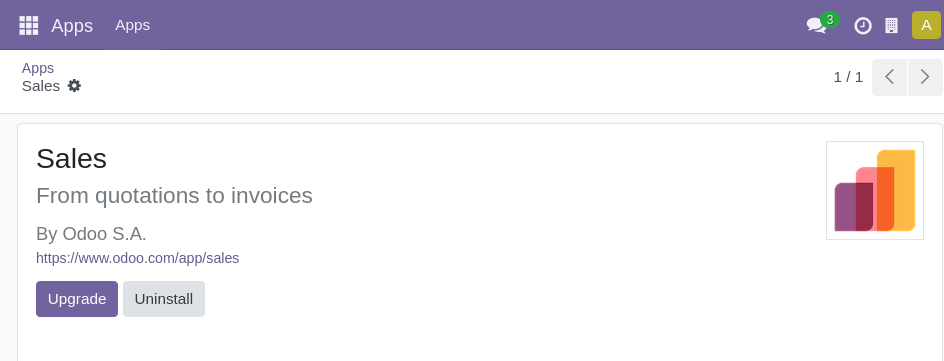
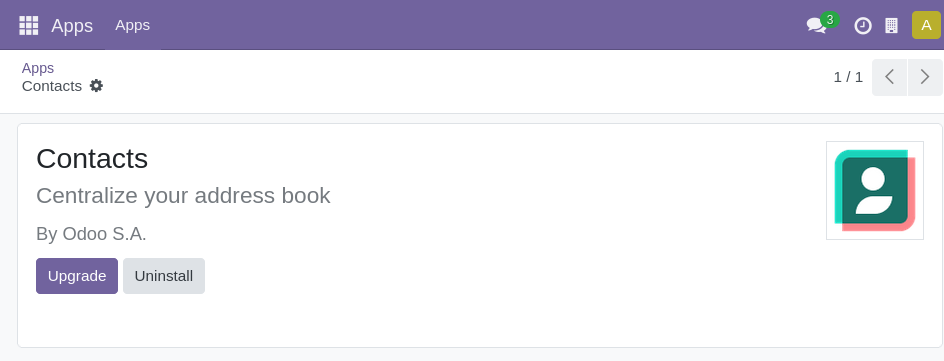
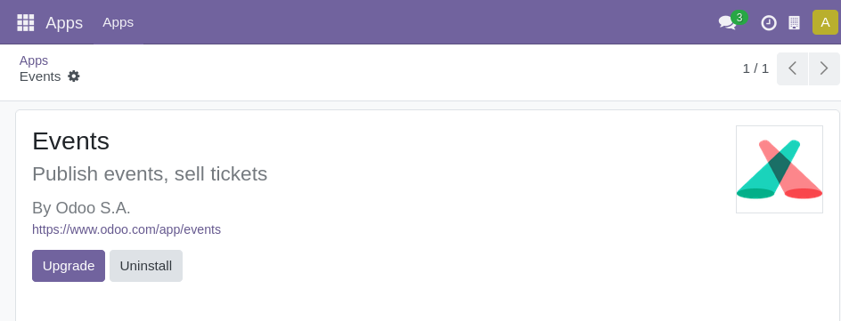
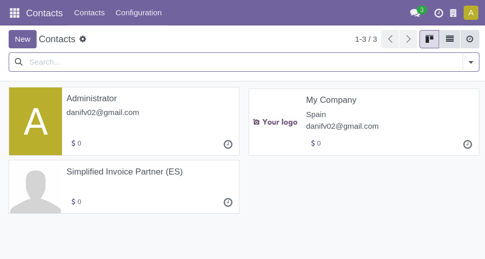
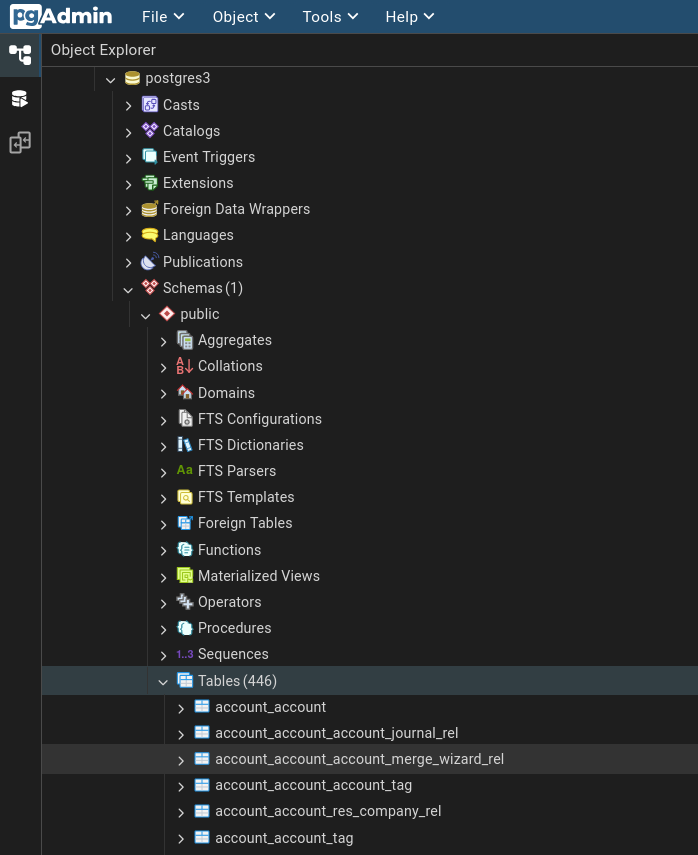
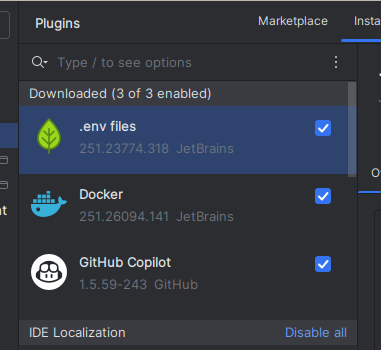

# Guía de Instalación de Odoo 18 con Docker Compose

Esta guía completa te llevará paso a paso por el proceso de instalación y configuración de un entorno de desarrollo Odoo 18 utilizando Docker, VS Code y PgAdmin. Está diseñada para personas que están comenzando y necesitan instrucciones detalladas.

## 📋 Tabla de Contenidos

1. [Requisitos Previos](#requisitos-previos)
2. [Paso 1: Preparar el IDE (VS Code)](#paso-1-preparar-el-ide-vs-code)
3. [Paso 2: Instalar Odoo 18 y PgAdmin con Docker Compose](#paso-2-instalar-odoo-18-y-pgadmin-con-docker-compose)
4. [Paso 3: Configurar PgAdmin](#paso-3-configurar-pgadmin)
5. [Paso 4: Crear Base de Datos en Odoo](#paso-4-crear-base-de-datos-en-odoo)
6. [Paso 5: Instalar Módulos en Odoo](#paso-5-instalar-módulos-en-odoo)
7. [Paso 6: Inspeccionar Base de Datos con PgAdmin](#paso-6-inspeccionar-base-de-datos-con-pgadmin)

---

## Requisitos Previos

Antes de comenzar, asegúrate de tener instalado:

- **Docker Desktop**: Para ejecutar contenedores (puedes descargarlo desde [docker.com](https://www.docker.com/))
- **VS Code** (o PyCharm si lo prefieres): Editor de código
- **Git**: Para clonar este repositorio (opcional)

---

## Paso 1: Preparar el IDE (VS Code)

### 1.1 Instalar VS Code

1. Descarga VS Code desde [code.visualstudio.com](https://code.visualstudio.com/)
2. Instala el programa siguiendo las instrucciones del instalador
3. Abre VS Code

### 1.2 Instalar Extensiones Útiles

Para trabajar con Docker, Python y Odoo, necesitarás instalar algunas extensiones. Ve a la sección de extensiones (icono de cuadrados en la barra lateral izquierda) y busca e instala las siguientes:

| Extensión | Utilidad |
|-----------|----------|
| **Docker** | Gestionar contenedores, imágenes y Docker Compose directamente desde VS Code |
| **Python** | Soporte completo para Python (autocompletado, depuración, linting) - esencial para Odoo |
| **Pylance** | Mejora el IntelliSense y análisis de código Python |
| **Dev Containers** | Permite desarrollar dentro de contenedores Docker |
| **YAML** | Ayuda con la sintaxis del archivo docker-compose.yml |
| **PostgreSQL** (opcional) | Facilita la conexión y consultas a bases de datos PostgreSQL |

### 1.3 Verificar Docker

Asegúrate de que Docker Desktop esté ejecutándose. Puedes verificarlo abriendo una terminal en VS Code y ejecutando:

```bash
docker --version
docker-compose --version
```

---

## Paso 2: Instalar Odoo 18 y PgAdmin con Docker Compose

### 2.1 Contenido del archivo docker-compose.yml

Este archivo define tres servicios que trabajarán juntos:

```yaml
services:

  odoo:
    image: odoo:18
    container_name: odoo
    ports:
      - "8069:8069" # Puerto para acceder a Odoo
    depends_on:
      - db
    environment:
      - HOST=db
      - USER=odoo
      - PASSWORD=odoo
    volumes:
      - odoo_data:/var/lib/odoo

  db:
    image: postgres:16
    container_name: odoo_db
    environment:
      - POSTGRES_USER=odoo
      - POSTGRES_PASSWORD=odoo
      - POSTGRES_DB=postgres
    volumes:
      - db_data:/var/lib/postgresql/data

  pgadmin:
    image: dpage/pgadmin4:latest
    restart: unless-stopped
    depends_on:
      - db
    environment:
      - PGADMIN_DEFAULT_EMAIL=danifv02@gmail.com
      - PGADMIN_DEFAULT_PASSWORD=Abc123.
    ports:
      - "8081:80" # Puerto para acceder a PgAdmin

volumes:
  odoo_data:
  db_data:
```

### 2.2 Levantar los Contenedores

Ejecuta el siguiente comando en la terminal:

```bash
docker-compose up -d
```

---

## Paso 3: Configurar PgAdmin

### 3.1 Acceder a PgAdmin

1. Abre tu navegador y ve a `http://localhost:8081`
2. Inicia sesión con:
   - **Email**: `danifv02@gmail.com`
   - **Password**: `Abc123.`


### 3.2 Registrar el Servidor PostgreSQL

1. Haz clic derecho en "Servers" → "Register" → "Server"
2. En la pestaña **General**: Name = `odoo`
3. En la pestaña **Connection**:
   - Host: `postgres` (primer intento) o `db` (segundo intento)
   - Port: `5432`
   - Maintenance database: `odoo`  
   - Username: `danifv02`
   - Password: (tu contraseña)


Si la primera configuración no funciona, usa:
   - Host: `db`
   - Username: `odoo`
   - Password: `odoo`
   - Maintenance database: `postgres`


### 3.3 Verificar Conexión

Una vez conectado verás el dashboard de PgAdmin:


Y podrás explorar las bases de datos:


---

## Paso 4: Crear Base de Datos en Odoo

### 4.1 Acceder a Odoo

1. Abre tu navegador y ve a `http://localhost:8069`
2. Completa el formulario de creación de base de datos:
   - **Database Name**: Elige un nombre (ej: `odoo_demo`)
   - **Email**: Tu email
   - **Password**: Tu contraseña
   - **Language**: Español
   - **Country**: España (o tu país)
   - **⚠️ MUY IMPORTANTE**: Marca **"Load demonstration data"**



---

## Paso 5: Instalar Módulos en Odoo

### 5.1 Acceder al Menú de Aplicaciones

Una vez creada la base de datos, accede al menú de **Aplicaciones**:



### 5.2 Instalar Módulos

Instala los módulos que necesites (Ventas, Compras, Inventario, etc.):







---

## Paso 6: Inspeccionar Base de Datos con PgAdmin

### 6.1 Ver la Nueva Base de Datos

Vuelve a PgAdmin y actualiza. Verás tu nueva base de datos de Odoo:



### 6.2 Explorar Tablas

Expande: Servers → odoo → Databases → [tu_bd] → Schemas → public → Tables



### 6.3 Ver Datos

Haz clic derecho en una tabla → "View/Edit Data" → "First 100 Rows":



---

## 🎉 ¡Listo!

Ahora tienes:
- ✅ Odoo 18 en `http://localhost:8069`
- ✅ PostgreSQL 16
- ✅ PgAdmin en `http://localhost:8081`
- ✅ Datos de demostración

### Comandos Útiles

```bash
docker-compose down          # Detener
docker-compose up -d         # Reiniciar
docker logs odoo -f          # Ver logs
docker-compose down -v       # Eliminar todo (⚠️ borra datos)
```

---

**Autor**: Daniel Figueroa  
**Versión**: Odoo 18 Community
